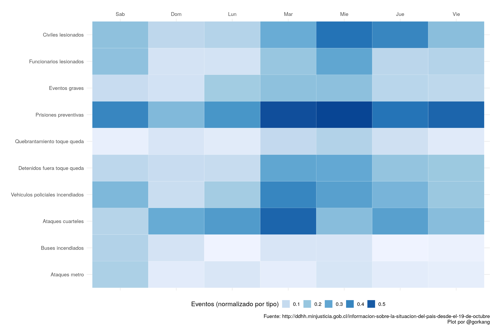

# Información sobre la situación del país desde el 19 de octubre

Evolución de la situación en Chile, según datos de Carabineros y PDI, desde el 19-oct. 

En este proyecto de R se extraen los datos del PDF compartido por el Ministerio de Justicia de Chile, y se muestran gráficamente.

---  

Fuente PDF: http://ddhh.minjusticia.gob.cl/informacion-sobre-la-situacion-del-pais-desde-el-19-de-octubre

Código: https://github.com/gorkang/2019-Chile

[[Descargar CSV últimos datos](outputs/data/LAST_raw_data.csv)]

---  

## Evolución de eventos

## Densidad de eventos por día de la semana

