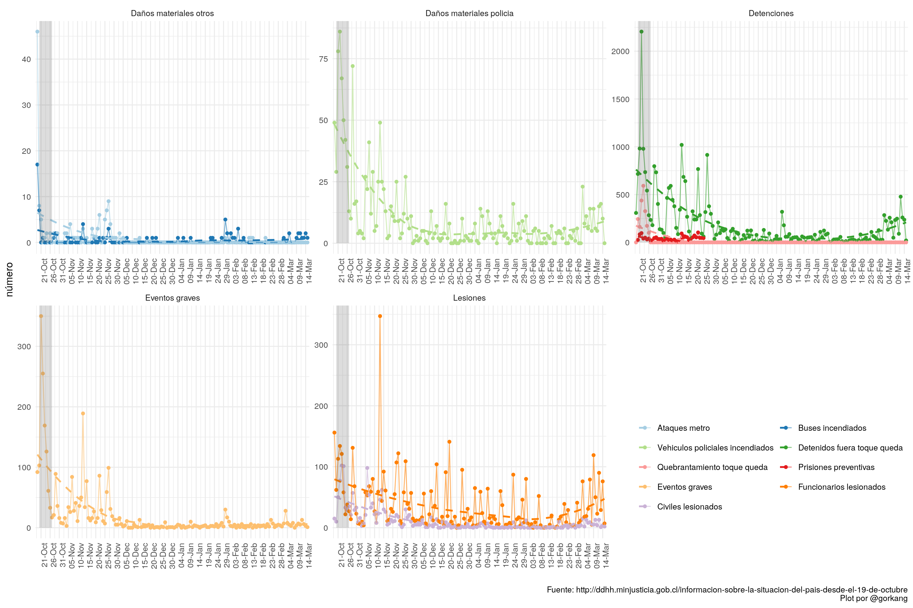
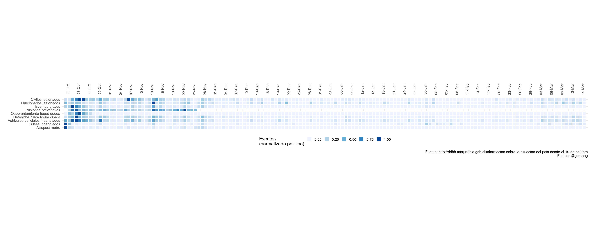
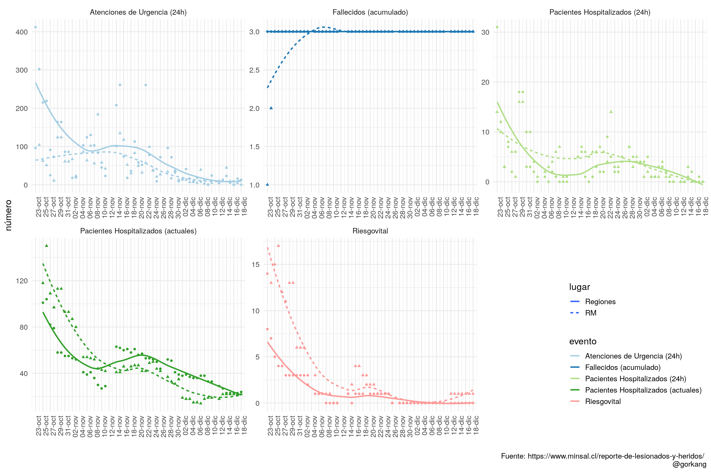

# Información sobre la situación de Chile desde el 19 de octubre

Extraemos y visualizamos la informacion compartida públicamente por organismos oficiales sobre la evolución de la situación en Chile desde el 19-oct. 

Usamos datos de Carabineros y PDI para mostrar información sobre daños físicos, lesiones, detenciones, eventos graves, y del Minsal para mostrar información sobre atenciones de urgencia, hospitalizaciones, fallecidos...

El codigo se puede encontrar en https://github.com/gorkang/2019-Chile

---  

### Fuentes

* Fuente PDF Carabineros + PDI: http://ddhh.minjusticia.gob.cl/informacion-sobre-la-situacion-del-pais-desde-el-19-de-octubre  
* Fuente Minsal: https://www.minsal.cl/reporte-de-lesionados-y-heridos/

### Datos extraidos 

* [[Descargar CSV últimos datos PDI + Carabineros](outputs/data/LAST_raw_data.csv)]
* [[Descargar CSV últimos datos Minsal](outputs/data/LAST_raw_data_minsal.csv)]

---  

# Carabineros + PDI

## Evolución de eventos

## Densidad de eventos

# Minsal

## Evolución de eventos

## Densidad de eventos

# Datos cruzados

## Carabineros + PDI vs Minsal

